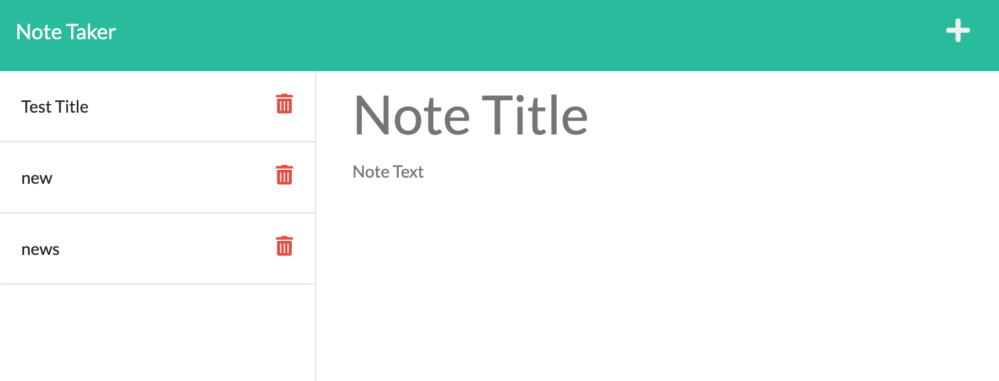

# note-taker

## Description

This application is a note taker app. With the use of node.js, express.js and code terminal, the user is presented with a note recording application.

## Future Development

In future development of this application I would like to finish the functionality of the overall application. The application still needs functionality to query saved notes.

## Usage

The application is deployed via heroku server and the link is provided below or opened via localhost:3001 from local network.

## Links

[Link to Application Repository](https://github.com/ArmondR/note-taker)

<!-- [Deployed Application](https://arcane-wave-43881.herokuapp.com/) -->

## Screenshot

### License

---

MIT License

Copyright (c) [2022] [Armond Rodriguez]

Permission is hereby granted, free of charge, to any person obtaining a copy
of this software and associated documentation files (the "Software"), to deal
in the Software without restriction, including without limitation the rights
to use, copy, modify, merge, publish, distribute, sublicense, and/or sell
copies of the Software, and to permit persons to whom the Software is
furnished to do so, subject to the following conditions:

The above copyright notice and this permission notice shall be included in all
copies or substantial portions of the Software.

THE SOFTWARE IS PROVIDED "AS IS", WITHOUT WARRANTY OF ANY KIND, EXPRESS OR
IMPLIED, INCLUDING BUT NOT LIMITED TO THE WARRANTIES OF MERCHANTABILITY,
FITNESS FOR A PARTICULAR PURPOSE AND NONINFRINGEMENT. IN NO EVENT SHALL THE
AUTHORS OR COPYRIGHT HOLDERS BE LIABLE FOR ANY CLAIM, DAMAGES OR OTHER
LIABILITY, WHETHER IN AN ACTION OF CONTRACT, TORT OR OTHERWISE, ARISING FROM,
OUT OF OR IN CONNECTION WITH THE SOFTWARE OR THE USE OR OTHER DEALINGS IN THE
SOFTWARE.

### Badges

---

